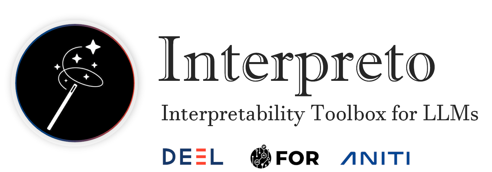

template: home.html
---



[](https://github.com/FOR-sight-ai/interpreto/actions?query=workflow%3Abuild)
[](TODO)
[](https://pypi.org/project/interpreto/)
[](https://pypi.org/project/interpreto/)
[](https://pepy.tech/project/interpreto)
[](https://github.com/FOR-sight-ai/interpreto/blob/main/LICENSE)

## 🚀 Quick Start

You can get acquainted with our library with our [Getting started](TODO) <sub> [](TODO)</sub> tutorial. `interpreto` can be installed using Pypi:

```python
pip install interpreto
```

Now that `interpreto` is installed, here are some basic examples of what you can do with the available modules.

## 📦 What's Included

TODO: A list or table of methods available

## 👍 Contributing

Feel free to propose your ideas or come and contribute with us on the Libname toolbox! We have a specific document where we describe in a simple way how to make your [first pull request](./contributing.md).

## 👀 See Also

More from the DEEL project:

- [Xplique](https://github.com/deel-ai/xplique) a Python library exclusively dedicated to explaining neural networks.
- [deel-lip](https://github.com/deel-ai/deel-lip) a Python library for training k-Lipschitz neural networks on TF.
- [Influenciae](https://github.com/deel-ai/influenciae) Python toolkit dedicated to computing influence values for the discovery of potentially problematic samples in a dataset.
- [deel-torchlip](https://github.com/deel-ai/deel-torchlip) a Python library for training k-Lipschitz neural networks on PyTorch.
- [DEEL White paper](https://arxiv.org/abs/2103.10529) a summary of the DEEL team on the challenges of certifiable AI and the role of data quality, representativity and explainability for this purpose.

## 🙏 Acknowledgments

This project received funding from the French ”Investing for the Future – PIA3” program within the Artificial and Natural Intelligence Toulouse Institute (ANITI). The authors gratefully acknowledge the support of the [DEEL](https://www.deel.ai) and the FOR projects.

## 👨‍🎓 Creators

Interpreto 🪄 is a project of the FOR and the [DEEL](https://www.deel.ai) teams at the [IRT Saint-Exupéry](https://www.irt-saintexupery.com/) in Toulouse, France.


## 🗞️ Citation

If you use Interpreto 🪄 as part of your workflow in a scientific publication, please consider citing 🗞️ [our paper](TODO):

```
TODO bibtex
```
